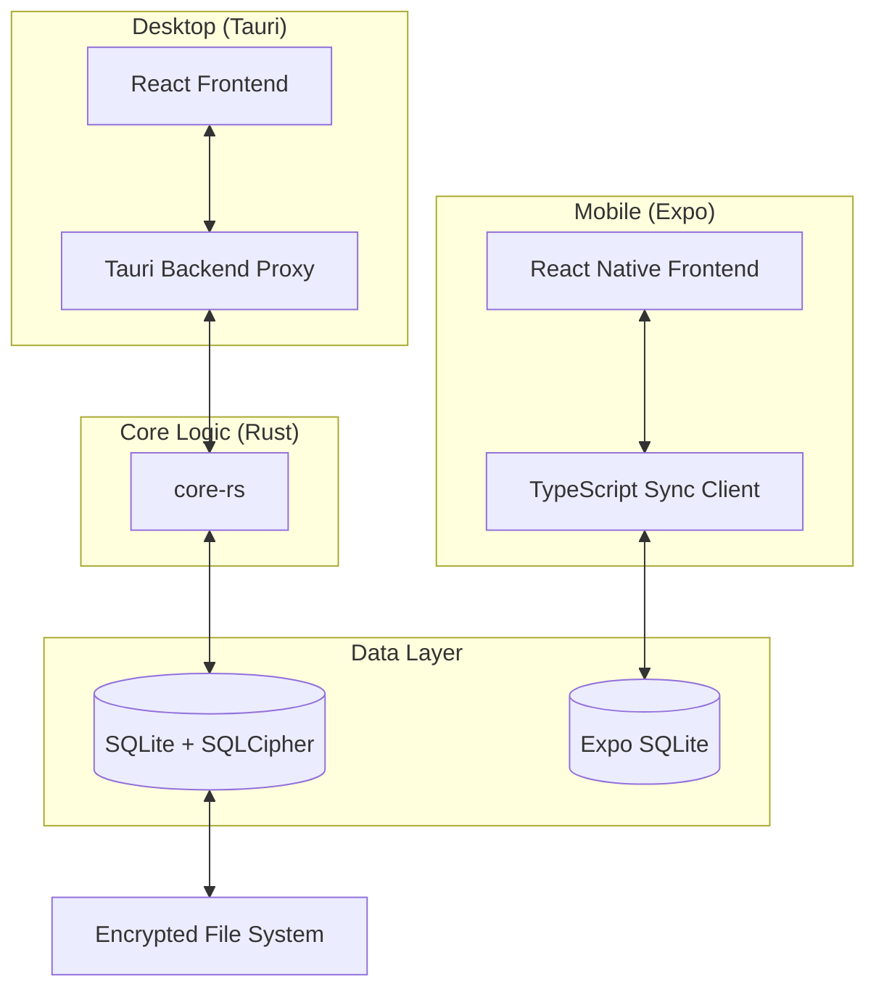

# System Architecture

## 1. Overview

Noteece is a local-first, privacy-centric workspace application designed to run seamlessly on desktop (Linux, macOS, Windows) and mobile (Android, iOS) devices. It employs a **Monorepo** structure to share core logic, types, and UI components across platforms.

## 2. High-Level Diagram

## 3. Core Components

### 3.1 `packages/core-rs` (The Brain)

This Rust crate acts as the central source of truth for the desktop application. It is a library crate, not a binary, designed to be embedded into the Tauri application.

- **Database Logic:**
  - Uses `rusqlite` with `bundled-sqlcipher` feature.
  - Manages migrations via `db.rs`.
  - Implements a connection pool using `r2d2` for concurrent access (e.g., sync running in background while user edits note).

- **Cryptography:**
  - **At Rest:** AES-256-GCM (via SQLCipher).
  - **Auth:** Argon2id (for KEK derivation).
  - **Blobs:** XChaCha20Poly1305 (via `RustCrypto`).

- **Search Engine:**
  - **Primary:** SQLite FTS5 (virtual table `note_fts`).
  - **Fallback:** Optimized `LIKE` queries if FTS5 is unavailable on the target system.
  - **Stemming:** Porter Stemmer.

- **Sync Protocol:**
  - State-based sync engine (`sync/engine.rs`).
  - Handles mDNS discovery, TCP transport, and conflict resolution.

### 3.2 `apps/desktop` (The Workstation)

Built with **Tauri v1**, this application provides a native desktop experience.

- **Frontend:**
  - **Framework:** React + TypeScript.
  - **Build Tool:** Vite.
  - **UI Library:** Mantine v7.
  - **State:** Zustand (with persist middleware).
  - **Routing:** React Router DOM v6.

- **Backend Bridge:**
  - Tauri commands (`src-tauri/src/commands.rs`) wrap `core-rs` functions.
  - **Isolation:** The webview has NO direct access to the file system or Node.js. All operations go through the IPC bridge, which acts as a security boundary.

### 3.3 `apps/mobile` (The Companion)

Built with **Expo** and **React Native**.

- **Database:**
  - Uses `expo-sqlite`.
  - Mirrors the `core-rs` schema exactly.
  - **Limitations:** No native FTS5 support in Expo Go (requires custom dev client for advanced features).

- **Sync Client (`sync-client.ts`):**
  - A TypeScript re-implementation of the `core-rs` sync logic.
  - This "Brain Split" is intentional to avoid the complexity of cross-compiling Rust for React Native (JSI) at this stage.
  - It ensures the mobile app remains a lightweight JavaScript bundle.

## 4. Build System

We use **TurboRepo** to orchestrate the build process.

- **Pipeline:**
  - `build`: Runs `cargo build` for core and `vite build` for desktop.
  - `lint`: Runs `eslint` and `cargo clippy`.
  - `test`: Runs `jest` and `cargo test`.
- **Caching:** TurboRepo caches build artifacts to speed up CI.

## 5. Design Patterns

### Local-First

Data is always written to the local encrypted database first. Sync is an optional, background process. This ensures zero latency and full offline capability.

### Monorepo Strategy

- **`packages/types`**: Shared TypeScript definitions. This is the "Rosetta Stone" ensuring the Rust backend (serialized via `serde`) and TypeScript frontend speak the same language.
- **`packages/ui`**: Shared React components (buttons, inputs) to maintain visual consistency between Desktop (Web) and Mobile (Native).

### Security by Design

- **Zero Knowledge (Serverless):** No central server holds your encryption keys.
- **End-to-End Encryption:** Sync traffic is encrypted using ephemeral keys derived from the pairing process (ECDH).
